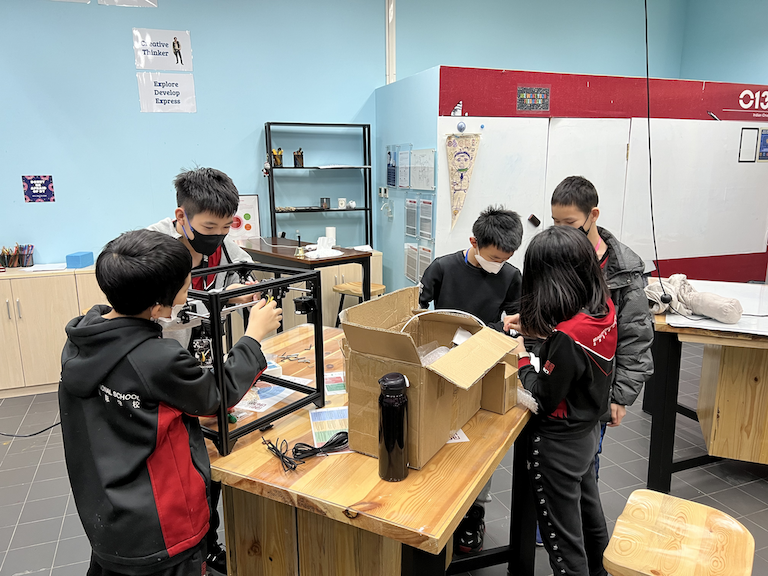
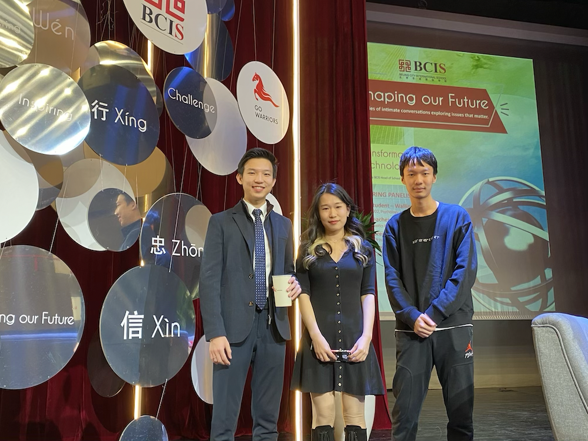
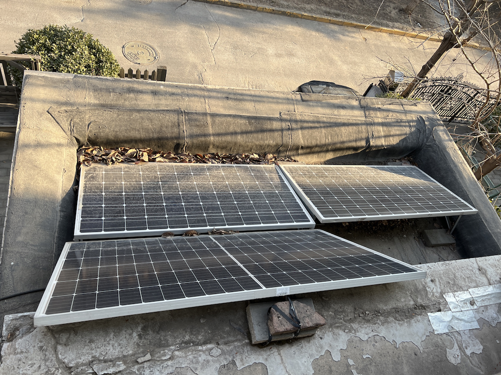

# Connected Learner

## Circuit EA

Circuit EA is an EA initiated by 2 of my friends and I. It is one of my collaborative project between the small team of mine. In this EA, our members will be creating cool technology-related products. Over the 5 years of this EA, we have created products such as drones, holographic clocks, and even a 3D printer. The photo above shows the creation process of the 3D printer. During each project, we have discussions where we split our members into different jobs, and we support each other if anyone encountered any unexpected problems, which is quite common when it comes to projects related to technology. Over the 5 years, we have progressed our EA from small projects where we work on simple circuit to large scale, whole-semester projects such as the 3D printer or the drone.

## Shaping our Future Panel

Shaping our Future panel is a panel hosted by our head of school Mr. Tom Egerton. The goal is to talk about our experiences in school related to meaningful topics (for example: innovations, technology). During the event, we can communicate with the audience, and share our experience with each other. The panel that I attended involves talking about creativity and innovations. I get to talk about a wide variety of topics and cover a variety of skills with the audience, such as working collaboratively, decision making, and explorations.

## Solar Panel Project

The solar panel project was started in grade 8, by developing a small prototype that charges one's smartphone. It is quite rudimentary, works spuradically, and is quite limited in terms of its capability. In grade 9, I once again took action by building the system shown in the picture. This is much more stable than my small prototype. Now, as the next advancement, I collaborated with Mrs. Kyrkos to bring my solar panel system to the school. However, this step requires more work than the previous ones. The challenges are no longer technological, but rather within communication and collaboration. We have to contact vendors to find the best purchase deal, then we have to contact the school's finance and engineers to ensure that the project is viable. Finally, we also opened workshops that trains younger students to also get involved with maintaining this project.
