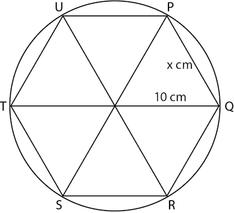
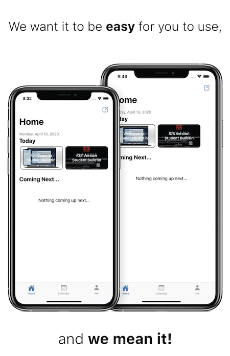

# Creative Thinker

## Math IA

In math class we are tasked to explore an area of interest of our choice. We can use any strategies (math tools, equations, theorems, etc.) to learn more about that topic. For my math IA, I chose to explore on how the constant π was developed. I used various method during the approach, including geometry and calculus. Exploring using geometry enables me to visualize the definition of the constant, while exploring through calculus allows me to calculate this constant to high degree of accuracy.

## Student Bulletin App

Student Bulletin is an app I've developed with a team of friends. This app aims to support the community in communication. It is a centralized platform that enables students to post latest news and events to share with everyone in the school. For this project, we started with identifying the need for communication within the school, then we start to develop a prototype of the solution to this problem, then we continue to iterate in order to create the solution that we have currently.
