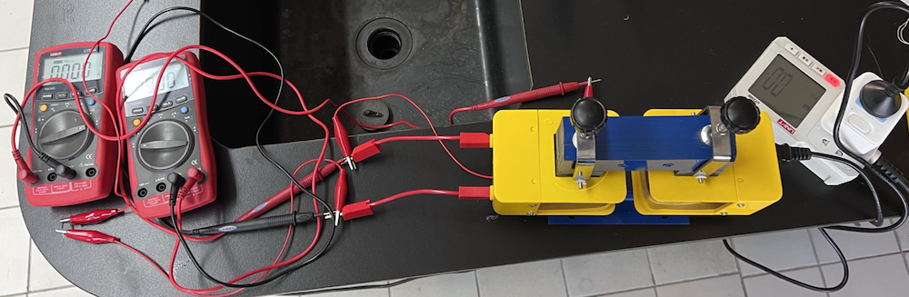
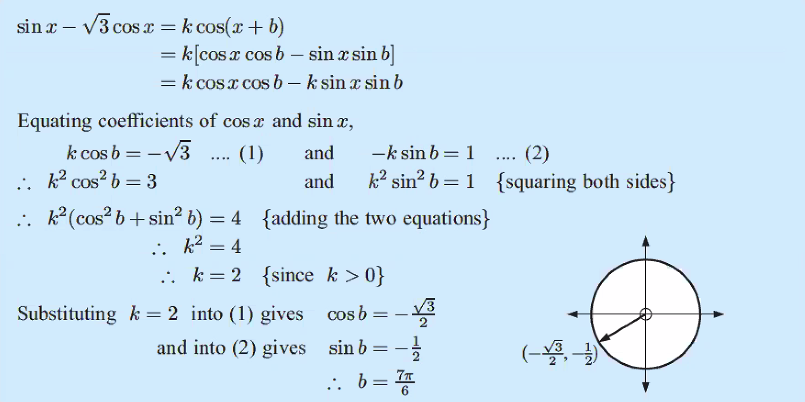

# Critical Thinker

## Transformer Experiment

In physics, we are required to explore an area of interest within the subject in the form of a lab experiment. We are required to find out about the topic in various ways. Starting with online/literary research to form a hypothesis, then plan an experiment that enables us to verify the hypothesis. My Physics IA was centered around a commonly used device called transformer. It is a device that changes the voltage of electricity through a process called electromagnetic induction. Through this IA I got the opportunity to experiment with changing different parts of the transformer, such as the core material, and number of turns of the coil, or the material of the coil. There are lots of challenges faced along the way. For example, I started by creating these transformers by myself, however, I realized that these transformer are way too inefficient. Progresses have been made to improve the efficiency by changing the shape and the material of the transformer. However, it is still too inefficient to do a full experiment, therefore I have to make the difficult decision to not use DIY transformers, and find an existing kit within the science department to perform the lab.

## Math

Math Analysis and Approaches class, as seen in its name, is heavily focused on analyzing the problem, and finding different approaches to reach the solution of the problem. For example, in the problem shown above, we are required to know that first we need to use the double angle identity, Pythagorean trigonometry identity, the concept of equality, and notice the domain and range of the equation to answer this simple question. In math class, I learned many problem solving skills, which I can take to other classes to solve different kinds of problems there, but applying the same skills.
