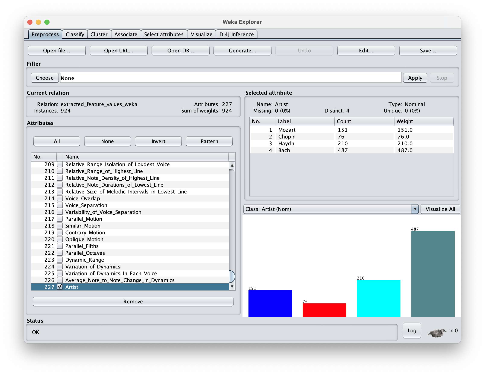
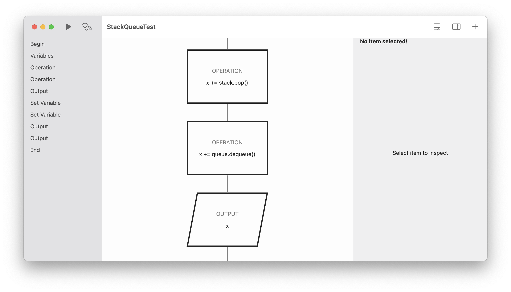

# Purposeful Doers

## Machine Learning

I chose machine learning as my extended essay topic. The screenshot depicts a software called WEKA, which is used primarily to test out different machine learining algorithm. Throughout the process, many decisions has to be made between the choice of sources and the experiment to perform before taking action to do them. These decision can be difficult, including many hours of experiment results being scrapped in favor for a more reliable tool that outputs better result to support my essay.

## Flowcharts

Flowchart is a tool to visualize algorithms in computer science. This concepts is quite difficult for some people to grasps. Therefore I decided to take action by creating this application to help them prototype flowcharts. Tools like these enables us to understand computer algorithms as beginners, it makes these concepts much easier to grasps. Creating this application challenged multiple skills of mine. First, I have to fully understand the concept of flowchart before designing the application. Then, I have to use my product design skills to design an app with a good user-experience, and make sure it is able to complete the intended function. Finally, I have to use my algorithmic thinking skills to make the app come to life.
